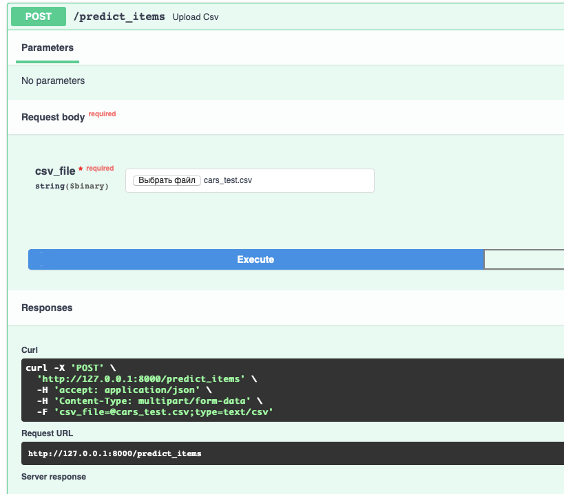
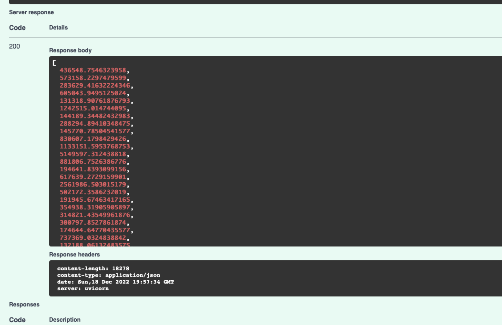
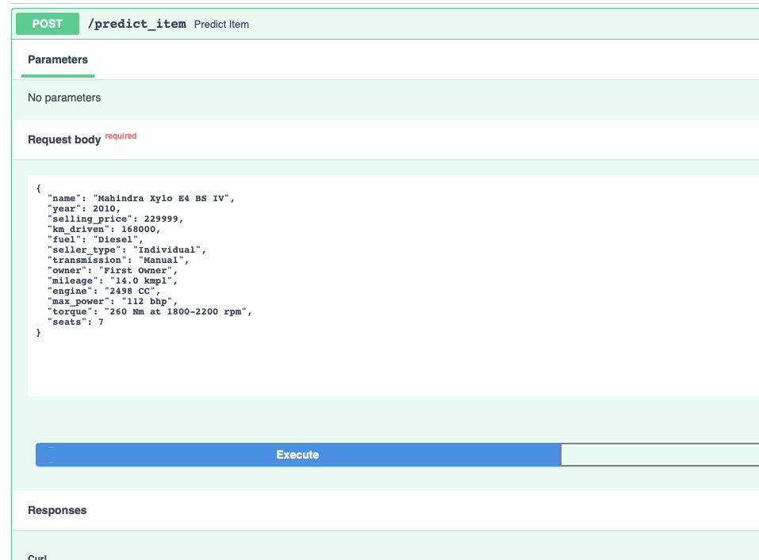
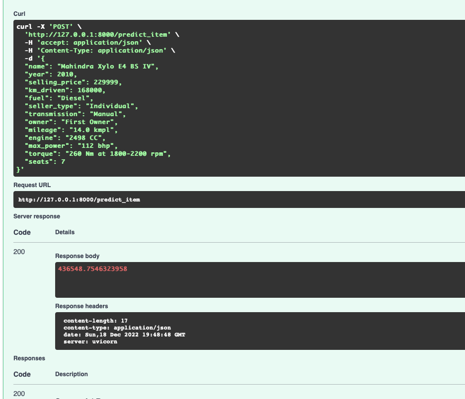

# Домашнее задание 1 (МОВС)

Этапы работы:

1) Простой EDA и обработка признаков
   
   - Удаление дублей
   - Преобразование признаков к нужным типам данных
   - Работа с пропусками

2) Визуализация

    - Попарные распределения числовых признаков
    - Тепловая карта попарных корреляций
    - Boxplot числовых признаков

3) Построение моделей

    - Линейные модели на числовых признаках (LinearRegression, Lasso, ElasticNet)
    - Линейные модели на данных с добавлением категориальных признаков (кодирование при помощи OneHotEncoder)
    - Перебор гиперпараметров модели

4) Feature Engineering

    - Удаление выбросов в трейне
    - Создание категориального признака - марки машины
    - Квадратичная зависимость цены машины от года
    - Логарифмирование признаков torque, max_power, engine, km_driven и целевой переменной
    - Создание дамми-переменной, отвечающую за пропуски в даты (были они или нет)

5) Построение итоговой модели 

   - Лучший результат получился с добавлением новых признаков, у модели Ridge с гиперпараметром alpha=0.73

6) Реализовали сервис на FastApi с возможностью отправлять признаки одного объекта, или сразу несколько в csv файле

Файл csv:

Один объект в виде json:

